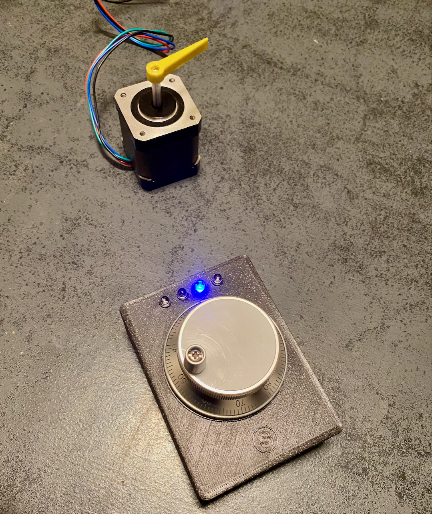
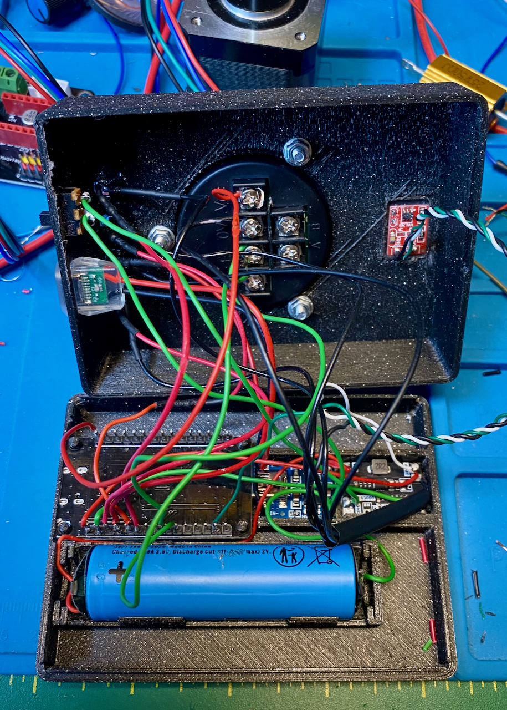

# **ESP32 Stepper Motor and Rotary Encoder Controller**

## **Overall Description**
This project enables the remote control of a stepper motor using two ESP32 devices via **ESP-NOW** communication.  
The system consists of:
- A **Sender ESP32**, connected to a rotary encoder and a touch sensor for mode selection.
- A **Receiver ESP32**, controlling a stepper motor via a DRV8825 driver.

The project provides:
- Accurate stepper motor control based on encoder input.
- Three user-selectable modes (**Fine**, **Normal**, **Fast**) for controlling the movement speed.
- Status indication via LEDs and a touch sensor interface.

---

## **Technology Used**
- **ESP-NOW**: A lightweight, peer-to-peer communication protocol for ESP32, used for fast and reliable data exchange.
- **PlatformIO**: An integrated development environment (IDE) for ESP32 development.
- **Rotary Encoder**: For generating step changes.
- **DRV8825**: A stepper motor driver for motor control.
- **Touch Sensor (TTP223)**: For mode switching.

---

## **Step-by-Step Instructions**

### **1. Find the MAC Address of the Receiver**
1. Navigate to the **`StepperController/src/`** folder and rename the file `FindMACAddress.cpp__` to `FindMACAddress.cpp`.
2. Compile and upload the file to the **Receiver ESP32** using PlatformIO.
3. The MAC address will be displayed in the **Serial Monitor**. Use this address in the **Sender** code (`Sender.cpp`).

**Note:** Ensure only one `.cpp` file is active in the `src` folder by renaming other `.cpp` files with `__` at the end (e.g., `FindMACAddress.cpp__`).

---

### **2. Burn the Code for the Receiver**
1. Navigate to the **`StepperController/src/`** folder.
2. Rename `Receiver.cpp__` to `Receiver.cpp`.
3. Compile and upload the code to the **Receiver ESP32** using PlatformIO.
4. Follow the wiring instructions provided in the file header to connect the stepper motor, DRV8825 driver, and LEDs.

---

### **3. Burn the Code for the Sender**
1. Navigate to the **`RotaryEncoderController/src/`** folder.
2. Open `Sender.cpp` and replace the `receiverMAC[]` variable with the MAC address of the **Receiver ESP32** obtained in Step 1.
3. Compile and upload the code to the **Sender ESP32** using PlatformIO.
4. Follow the wiring instructions provided in the file header to connect the rotary encoder, LEDs, and touch sensor.

---

## **Connections**
For detailed wiring instructions, refer to the header comments in each `.cpp` file.  
All necessary GPIO pin mappings and configuration details are documented in each code file.

---

## **Project Structure**
```
ESP32-Stepper-Controller
├── 3DprintingRelated/            # STL files for 3D printing the enclosure
│   ├── 3Drenderings/             # Rendered images of the enclosure design
│   │   ├── rend1.png
│   │   ├── rend2.png
│   │   ├── rend3.png
│   │   ├── rend4.png
│   │   └── rend5.png
│   ├── STLprintingFiles/         # STL files for 3D printing
│   │   ├── BOTTOM.stl
│   │   ├── FEETS.stl
│   │   └── TOP.stl
│   └── Fusion360designFile.f3d   # Modifiable Fusion 360 design file
├── Documentation/                # Component details and sources
│   ├── Pictures/
│   │   ├── housingClosed.png     # Photo of the closed housing
│   │   └── housingOpen.png       # Photo of the open housing with components
│   ├── ESP32 Manual MLA...pdf    # Documentation for the ESP32 MLA components
│   └── Rotary Encoder.pdf        # Rotary Encoder details and source
├── RotaryEncoderController/      # Code for the Sender ESP32
│   ├── src/
│   │   ├── IOTest.cpp__          # Test script for rotary encoder connections
│   │   ├── Sender.cpp            # Main sender code
│   │   ├── platformio.ini        # PlatformIO configuration (no changes needed)
│   │   └── README.md             # Folder-specific instructions
├── StepperController/            # Code for the Receiver ESP32
│   ├── src/
│   │   ├── FindMACAddress.cpp__  # Script to find receiver MAC address
│   │   ├── IOTest.cpp__          # Test script for stepper motor connections
│   │   ├── Receiver.cpp          # Main receiver code
│   │   ├── platformio.ini        # PlatformIO configuration (no changes needed)
│   │   └── README.md             # Folder-specific instructions
└── README.md                     # Main project instructions
```

---

## **Resources**
- The **`Documentation`** folder contains information about all the components used in this project, including their sources (AliExpress, etc.).
- The **`3DprintingRelated`** folder includes STL files for printing the enclosure of the project.

---

## **Build System Picture**

<p align="center">
  
  
</p>

---

## **Video Demonstration**
[](https://youtu.be/UbahWgo1rvE)

*Video showcasing the project in action.*